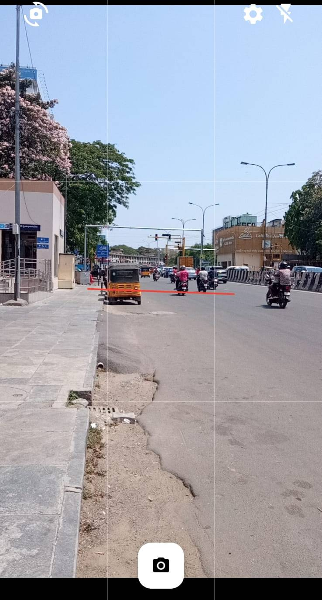
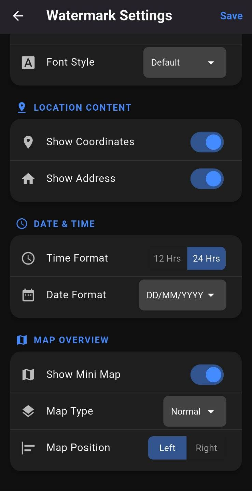
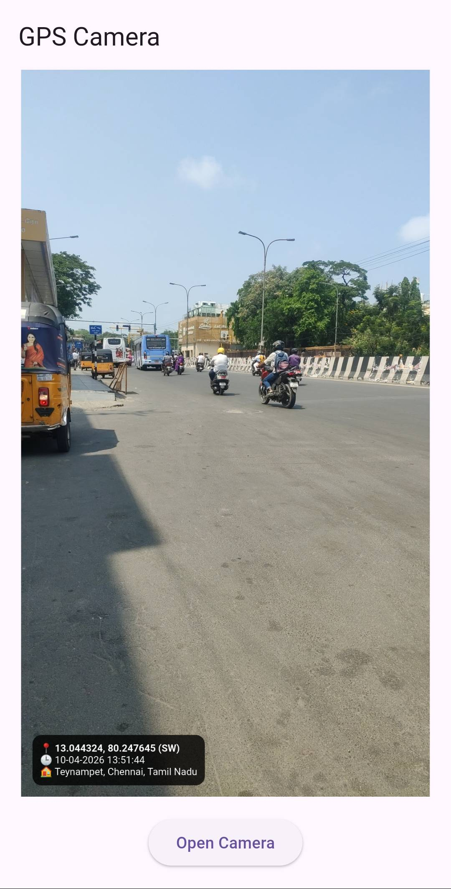

<p align="center">
  
</p>

<h1 align="center">Geo Tag Camera 📸📍</h1>

<p align="center">
  <strong>A premium Flutter package providing a fully customizable camera UI for capturing photos with automatic geo-location, compass direction, date, and address watermarks stamped directly onto the image.</strong>
</p>

<p align="center">
  <a href="https://pub.dev/packages/geo_tag_camera"></a>
  <a href="https://flutter.dev"></a>
  <a href="https://github.com/ranjith4084/gps_camera/blob/main/LICENSE"></a>
</p>

---

## 🌟 Features

* ✨ **Custom Camera UI:** Clean, intuitive preview with tap-to-focus and pinch-to-zoom capabilities.
* 📍 **Automatic Watermarking:** Automatically reads device GPS and stamps latitude, longitude, and actual street address directly onto your pictures.
* 🧭 **Compass Heading:** Real-time magnetometer analysis indicating the direction the camera is facing (N, NW, SE, etc.).
* 📐 **Smart Overlays:** Built-in **Rule of Thirds** grid overlay and active device angle sensors (gyroscope alignment) to capture perfect shots.
* 🎨 **Themes & Configuration:** Seamlessly toggle between **Dark/Light** watermark themes, aspect ratios (16:9, 4:3), and corner placement natively from the settings.
* 📱 **Cross-Platform:** Works right out of the box on both **Android & iOS**, requesting all the necessary permissions internally.

---

## 📸 Screenshots

<p align="center">
  
  
  
  
</p>

---

## 🚀 Installation

To use `geo_tag_camera` in your project, add the dependency to your `pubspec.yaml` file:

```yaml
dependencies:
  geo_tag_camera: ^1.0.0+1
```

Then, run:
```bash
flutter pub get
```

---

## 🛠️ Usage

To use the camera feature, simply navigate to the `CameraPage`. The package will effortlessly handle requesting camera and location permissions from the user.

```dart
import 'package:flutter/material.dart';
import 'package:geo_tag_camera/geo_tag_camera.dart';

class MyScreen extends StatelessWidget {
  @override
  Widget build(BuildContext context) {
    return Scaffold(
      body: Center(
        child: ElevatedButton(
          child: const Text("Open Geo Camera"),
          onPressed: () async {
            // Push the camera page onto the navigation stack
            final resultFile = await Navigator.push(
              context,
              MaterialPageRoute(builder: (_) => const CameraPage()),
            );

            if (resultFile != null) {
              print("Picture saved to: ${resultFile.path}");
            }
          },
        ),
      ),
    );
  }
}
```

---

## ⚙️ Native Permissions Setup

### Android
Add these permissions to your `android/app/src/main/AndroidManifest.xml`:
```xml
<uses-permission android:name="android.permission.CAMERA" />
<uses-permission android:name="android.permission.ACCESS_FINE_LOCATION" />
<uses-permission android:name="android.permission.ACCESS_COARSE_LOCATION" />
```

### iOS
Add these keys to your `ios/Runner/Info.plist`:
```xml
<key>NSCameraUsageDescription</key>
<string>This app needs camera access to capture photos.</string>
<key>NSLocationWhenInUseUsageDescription</key>
<string>This app needs access to your location to watermark photos.</string>
<key>NSLocationAlwaysUsageDescription</key>
<string>This app needs access to your location to watermark photos.</string>
```

---

## 👨‍💻 Author

Built with ❤️ by [**Ranjith**](https://github.com/ranjith4084)  
- **GitHub:** [@ranjith4084](https://github.com/ranjith4084)
- **Portfolio:** [rebrand.ly/ranjith4084](https://rebrand.ly/ranjith4084)

If you found this package helpful, consider giving it a ⭐ on GitHub and a 👍 on [pub.dev](https://pub.dev)!

## 📄 License

This project is licensed under the MIT License - see the [LICENSE](LICENSE) file for details.